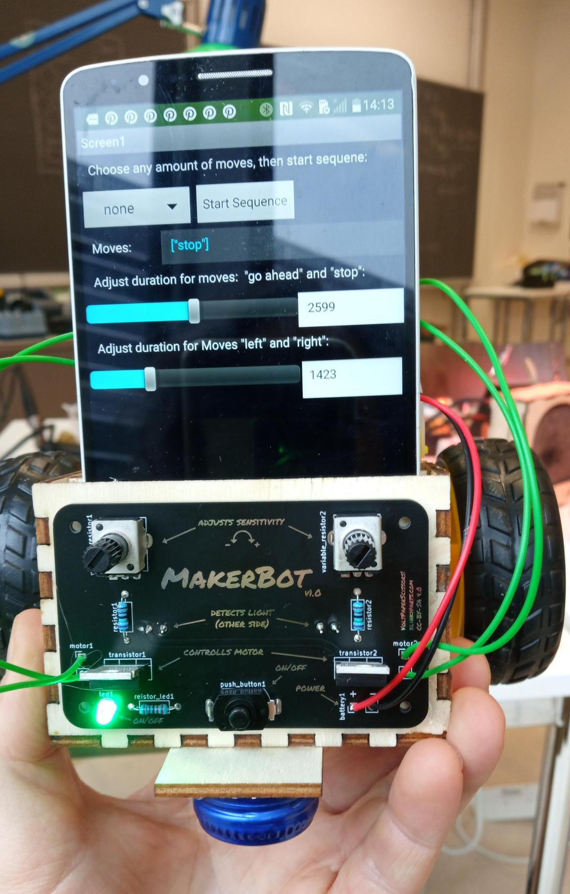
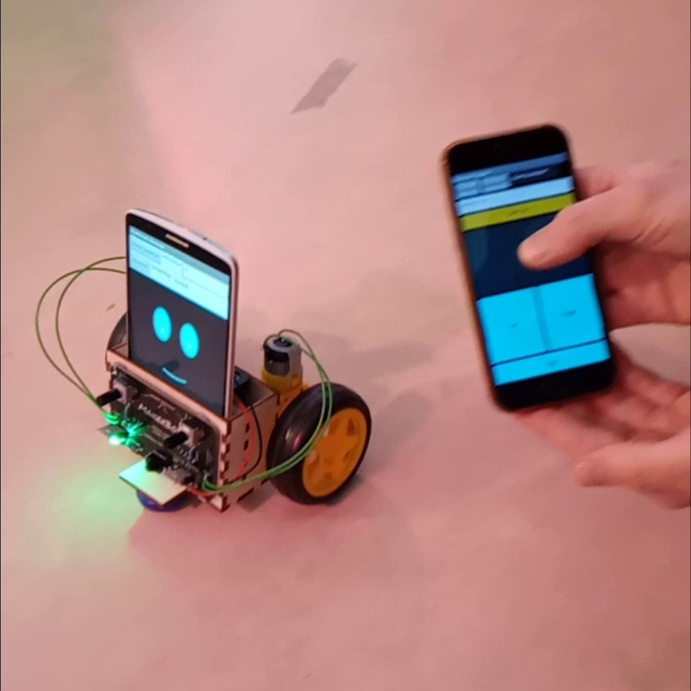

# Smartphone Robot - An easy robot you can control with your Smartphone

This is an easy robot soldering kit. The fun part is, you don't program the hardware. You just add an Smartphone and due to light signals it controlls the motors of the robot. Thus you can easily controll the robot with any smartphone wihtout any programming skills. You want to take it further? No problem. We also have an coding guide to program your own app.

## Where to Buy?
You can purchase the Smartphone Robot kit in our online store:

➡️ [Buy the Smartphone Robot Kit Here]()

## Features
- **Easy soldering kit** – Perfect for beginners
- **Innovative mechanism** – Turns on by simply rotating the egg
- **RGB LEDs for stunning lighting effects**
- **Great Easter gift** – Decorative and interactive
- **Sustainable materials** – 3D-printed parts made from recycled PLA

## Included in the Kit
| Quantity  | Description 									|
|:---------:|:----------------------------------------------|
| 1 		| PCB 											|
| 1 		| Battery Holder 3xAA 							|
| 1 		| LED 3mm green 								|
| 2 		| LDR (Light Sensor) 							|
| 2 		| Motors 										|
| 1 		| Push Button 									|
| 2 		| 10k Motor Resistor 							|
| 1 		| 1k LED Resistor 								|
| 2 		| Transistor IRLB8721 							|
| 13 		| Lasercut Wooden Parts 						|
| 1 		| Teflon Slider (optional) 						|
| 1 		| Plastic Cap of an PET Bottle (not included) 	|
| 2			| Rubber Ring (68mm) 							|
| 4			| Wire (12cm)									|
| 4			| Zip Tie (not included)						|

## Needed tools (not included)
- Wood glue
- Hot glue
- Soldering iron

## Assembly Instructions
For assembly, you will need:

A detailed **step-by-step guide** is available in the Wiki and GitHub repository.

## License
This project is licensed under **CC-BY-SA 4.0** - [Volt, Paper, Scissors!](https://www.voltpaperscissors.com/) and [Timo Schindler](https://shop.blinkyparts.com)

**Happy Soldering! 🚀🥚**

